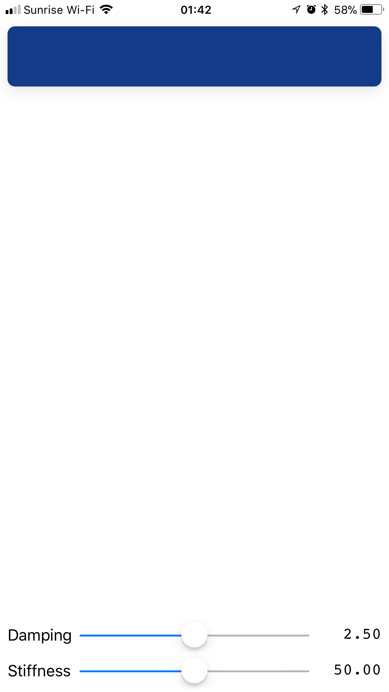
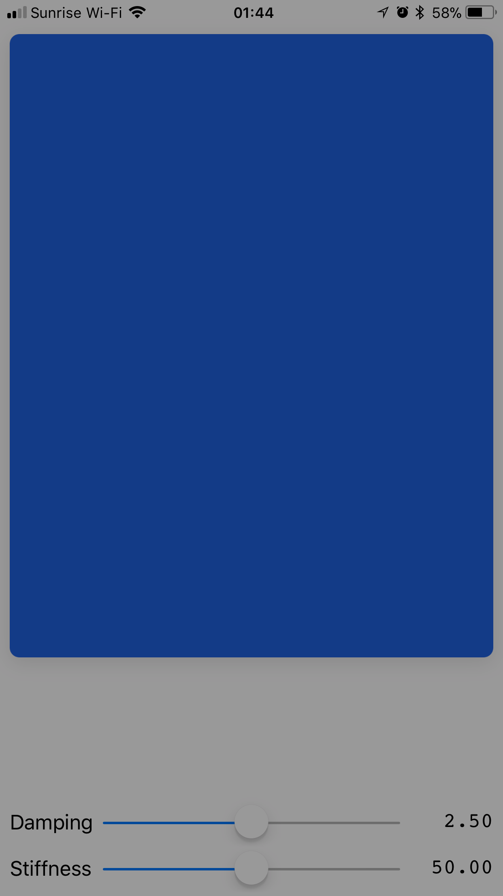

	  
	
	

# PullToExpand

Simple, customizable view that can be expanded by pulling down on it.

## Fun Facts

* Uses a UIViewPropertyAnimator with spring timing parameters.
* `@IBDesignable`: fully customizable and previewable in interface builder.
* Also easy to instantiate programmatically.

## Preview

This is just one of infinitely many ways to configure it, of course.

<table>
	<tr>
		<td>compact</td>
		<td>expanded</td>
	</tr>
	<tr>
		<td></td>
		<td></td>
	</tr>
</table>
